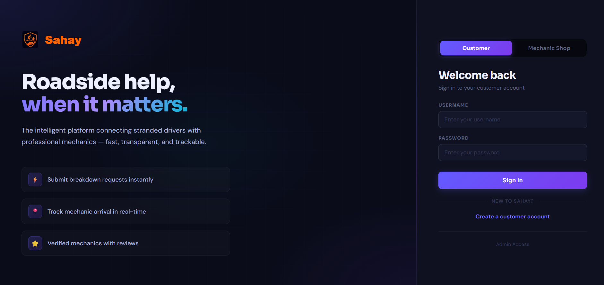
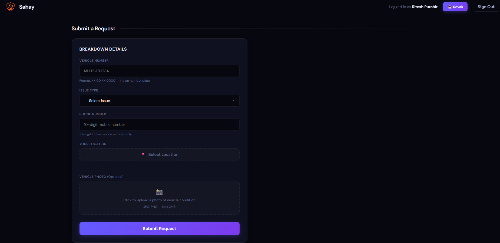
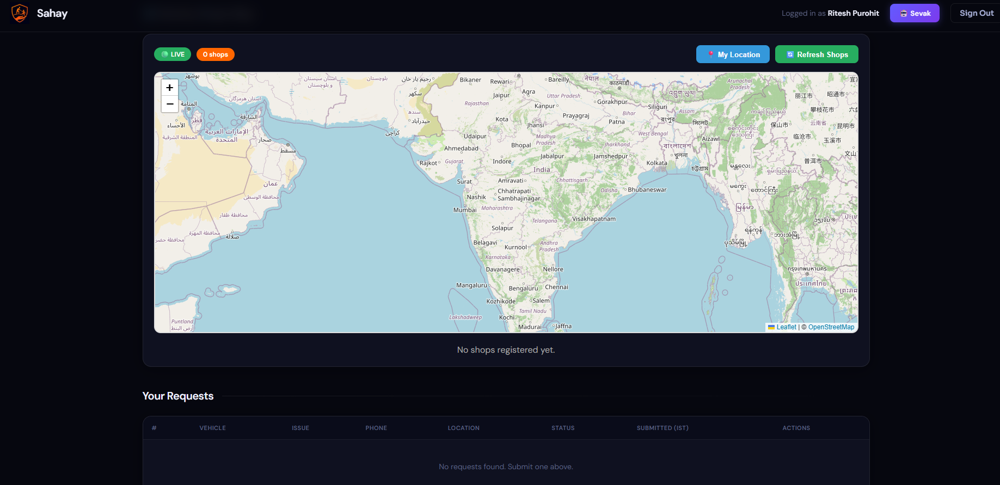
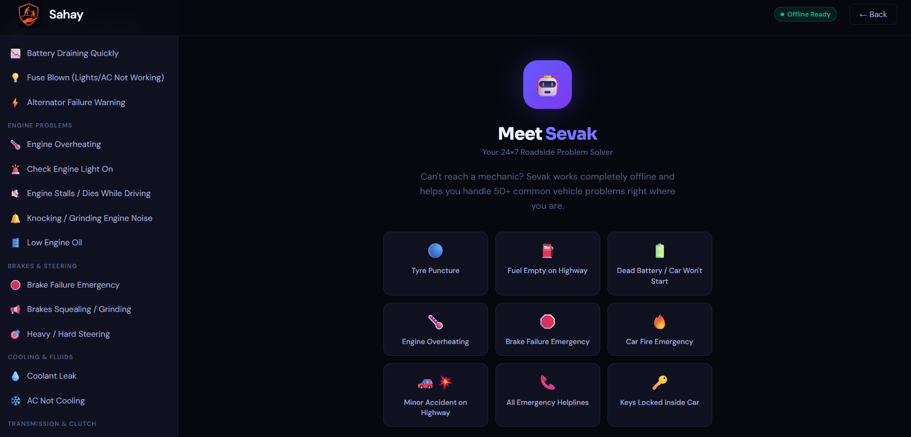
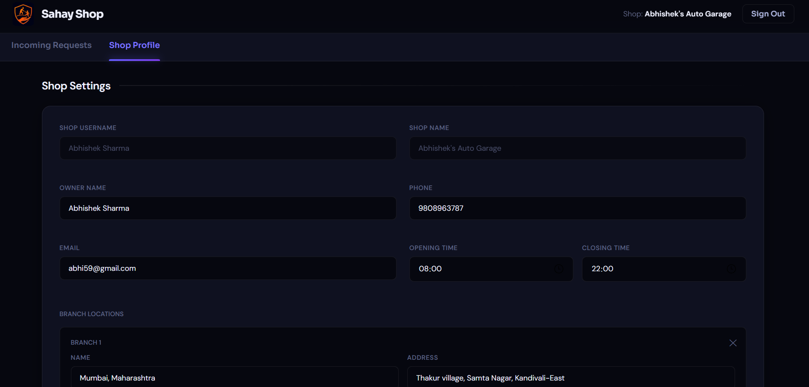
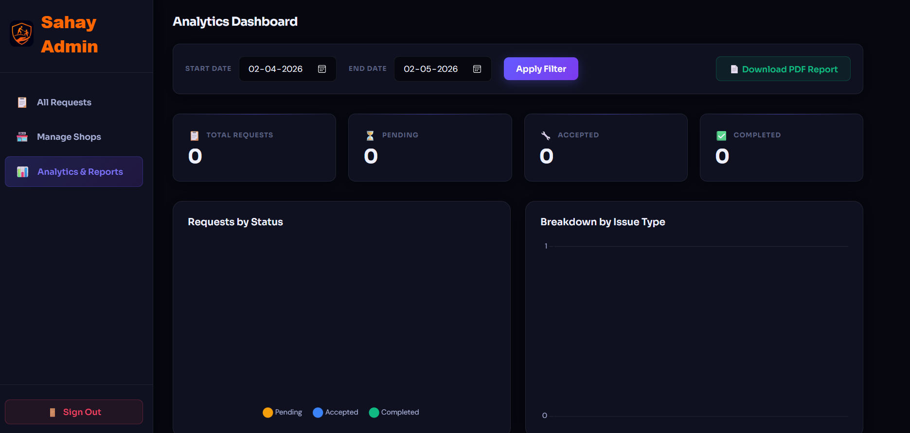

<div align="center">


# Sahay — Smart Roadside Assistance

**Roadside help, when it matters.**

The intelligent platform connecting stranded drivers with professional mechanics — fast, transparent, and trackable.

[](http://localhost:8082)
[](https://openjdk.org/)
[](https://spring.io/projects/spring-boot)
[](https://www.mysql.com/)
[](https://www.docker.com/)

</div>

---

## 📸 Screenshots

### 🔐 Login Page


### 👤 Customer Dashboard


### 🗺️ Nearby Shops Map


### 🤖 Sevak — Offline Chatbot


### 🔧 Shop Dashboard


### 🛡️ Admin — Analytics Dashboard


---

## ✨ Features

### 👤 Customer
- Register & login securely
- Submit breakdown requests with vehicle number, issue type, phone & live location
- Upload vehicle photo (optional)
- Track request status in real-time
- View nearby mechanic shops on an interactive map (Leaflet + OpenStreetMap)
- **Sevak** — offline 24×7 chatbot for 50+ roadside problems

### 🔧 Mechanic Shop
- Register shop with branch locations, opening hours & contact details
- Receive and manage incoming breakdown requests
- Accept / complete / reject customer requests
- Email notifications on new requests

### 🛡️ Admin
- View and manage all service requests
- Manage registered shops
- Analytics dashboard — total requests, pending, accepted, completed
- Filter by date range & download PDF reports

### 🤖 Sevak (Offline Chatbot)
- Works 100% offline — no internet needed
- Covers 50+ problems across 10 categories:
  - Tyre Problems, Fuel Issues, Battery & Electrical
  - Engine Problems, Brakes & Steering, Cooling & Fluids
  - Transmission & Clutch, Lights & Visibility, Keys & Locks
  - Highway Emergencies
- One-tap call buttons for government helplines (NH 1033, 100, 108, 101, 112)
- All major manufacturer assist numbers (Maruti, Hyundai, Tata, Honda, Toyota, etc.)

---

## 🛠️ Tech Stack

| Layer | Technology |
|---|---|
| Backend | Java 17, Spring Boot 3, Spring Security, Spring Data JPA |
| Database | MySQL 8.0 (Clever Cloud) |
| Frontend | HTML5, CSS3, Vanilla JavaScript |
| Maps | Leaflet.js + OpenStreetMap |
| Email | JavaMail (Gmail SMTP) |
| Deployment | Docker, Render |
| Build Tool | Maven |

---

## 🚀 Run Locally

### Prerequisites
- Java 17+
- Maven 3.6+
- MySQL 8.0

### Steps

**1. Clone the repository**
```bash
git clone https://github.com/Ritesh-453/Sahay.git
cd Sahay
```

**2. Set up the database**
```sql
CREATE DATABASE RoadAssistDB;
```

**3. Configure environment variables**

Create a `.env` file or set these in your environment:
```env
DB_URL=jdbc:mysql://localhost:3306/RoadAssistDB
DB_USERNAME=root
DB_PASSWORD=your_password
MAIL_USERNAME=your_email@gmail.com
MAIL_PASSWORD=your_app_password
PORT=8082
```

**4. Run the application**
```bash
mvn spring-boot:run
```

**5. Open in browser**
```
http://localhost:8082
```

---

## 🐳 Run with Docker

```bash
docker build -t sahay .
docker run -p 8082:8082 \
  -e DB_URL=jdbc:mysql://your-db-host:3306/RoadAssistDB \
  -e DB_USERNAME=your_username \
  -e DB_PASSWORD=your_password \
  -e MAIL_USERNAME=your_email \
  -e MAIL_PASSWORD=your_app_password \
  sahay
```

---

## 📁 Project Structure

```
src/
├── main/
│   ├── java/com/example/breakdown/
│   │   ├── controller/        # REST API controllers
│   │   ├── model/             # JPA entities (User, Shop, ServiceRequest)
│   │   ├── repository/        # Spring Data JPA repositories
│   │   ├── service/           # Business logic & email service
│   │   └── config/            # Security & password config
│   └── resources/
│       ├── static/            # Frontend HTML/CSS/JS files
│       │   ├── index.html     # Login page
│       │   ├── customer.html  # Customer dashboard
│       │   ├── shop-dashboard.html
│       │   ├── admin.html
│       │   ├── analytics.html
│       │   ├── shops.html
│       │   └── sevak.html     # Offline chatbot
│       └── application.properties
├── Dockerfile
└── pom.xml
```

---

## 🌐 Deployment

The app is deployed on **Render** (Docker runtime) with **Clever Cloud MySQL** as the database.

- **Live URL:** http://localhost:8082
- **Database:** Clever Cloud MySQL 8.0 (Paris region)

> ⚠️ Free tier on Render spins down after inactivity — first request may take 50+ seconds.

---
