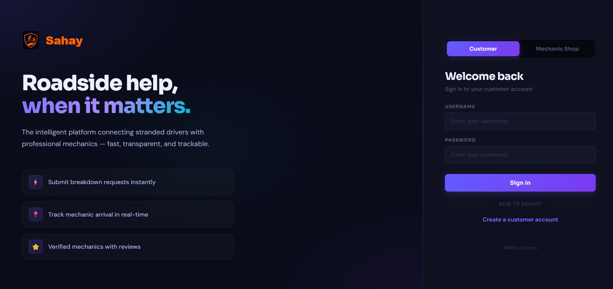
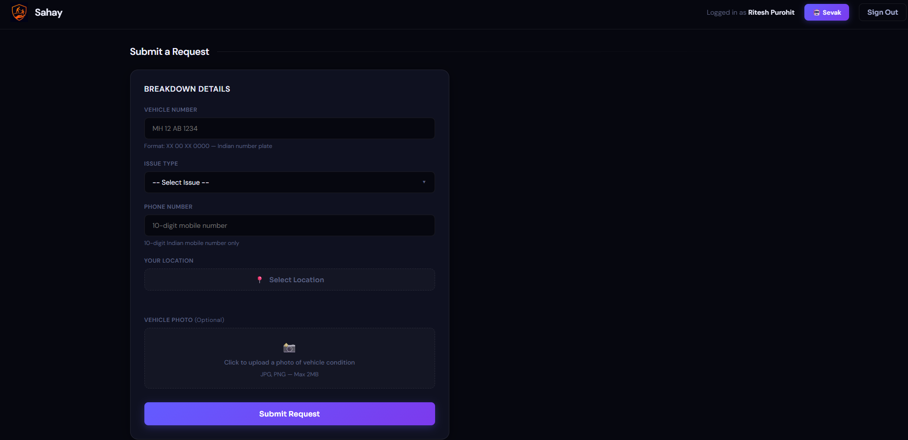
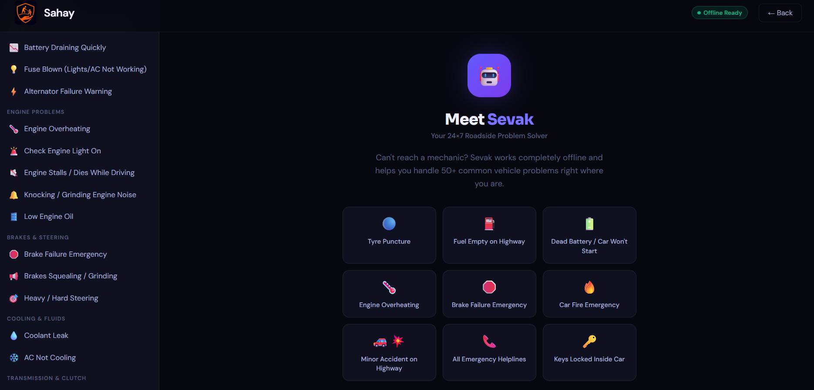
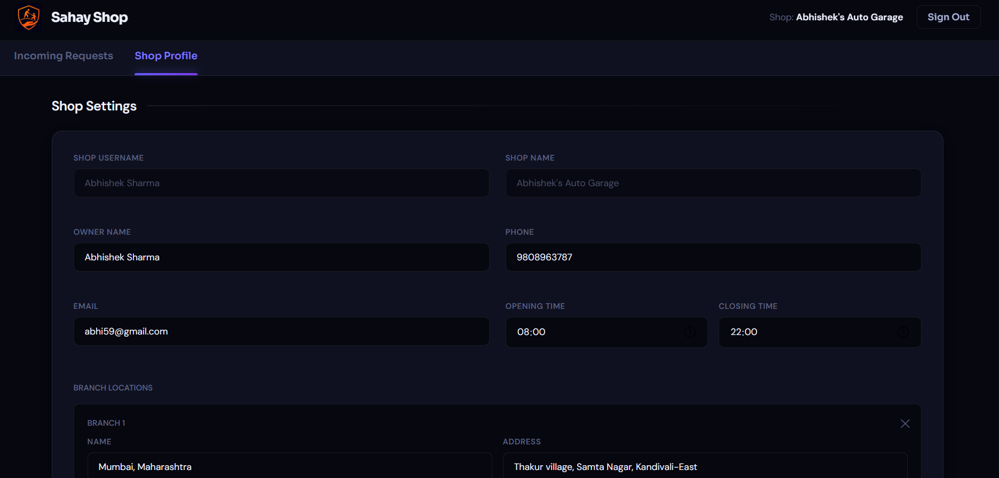
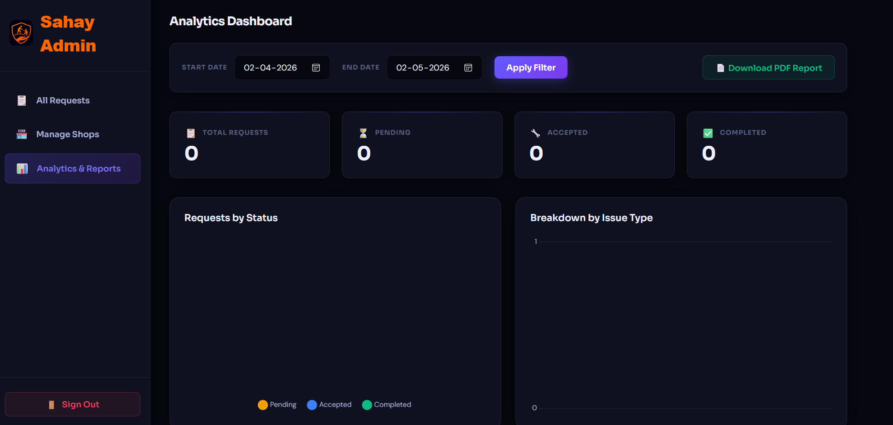

# Sahay: Smart Roadside Assistance

## Screenshots

### Login Page

### Customer Dashboard

### Sevak: Offline Chatbot

### Shop Dashboard

### Admin: Analytics Dashboard

---

## What it does
- Connects stranded drivers with nearby mechanic shops
- Customers raise breakdown requests with live location and track status in real time
- Shops accept, complete or reject requests and get email alerts
- Admin manages shops and requests, views analytics and downloads PDF reports
- Sevak: offline chatbot covering 50+ roadside problems

## Tech used
- **Backend:** Java 17, Spring Boot 3, Spring Security, Spring Data JPA
- **Database:** MySQL 8
- **Frontend:** HTML, CSS, JavaScript
- **Maps:** Leaflet.js + OpenStreetMap
- **Email:** JavaMail (Gmail SMTP)
- **Build and deploy:** Maven, Docker, Render

## Live link
https://sahay-9cw5.onrender.com/

> Free tier: the first load may take around 50 seconds.

---

## Demo Credentials

| Role | Username | Password |
|---|---|---|
| Customer | Ritesh Purohit | Ritesh@1234 |
| Admin | Admin | admin123 |
| Shop Owner 1 | Abhishek Sharma | Abhishek@1234 |
| Shop Owner 2 | Pratik Sharma | Shop@123 |